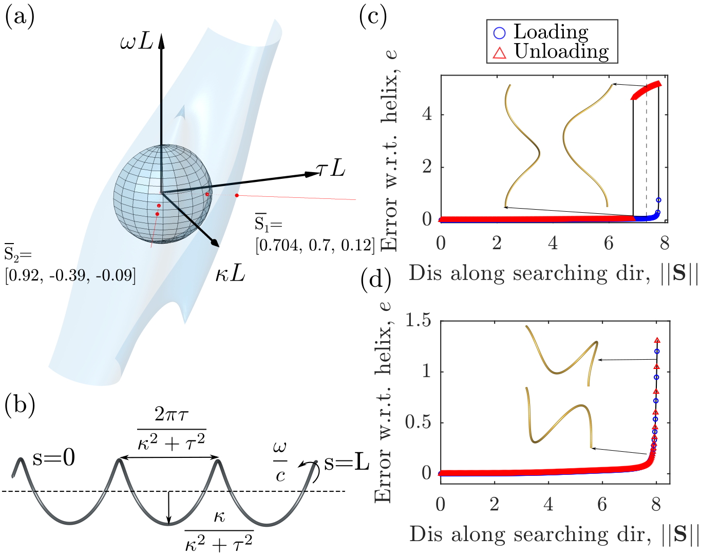

# Helix_Bifurcation_Types

Codes for studying the pitch-fork bifurcations of a initially rod with helical centerline.

<p align="center">

<br>
<em> Figure 1. Studied systems and various types of pitch-fork bifurcations. </em>
</p>

***

## Simulation Codes
The simCodes contain the required codes for executing numeric experiments along various exploring directions in the parameter space as shown in Fig. 1(a)

### Dependencies
Install the following C++ dependencies:
- [Eigen](http://eigen.tuxfamily.org/index.php?title=Main_Page)
  - Eigen is used for various linear algebra operations.
  - IMC is built with Eigen version 3.4.0 which can be downloaded [here](https://gitlab.com/libeigen/eigen/-/releases/3.4.0). After downloading the source code, install through cmake as follows.
    ```bash
    cd eigen-3.4.0 && mkdir build && cd build
    cmake ..
    sudo make install
    ```

- [OpenGL / GLUT](https://www.opengl.org/)
  - OpenGL / GLUT is used for rendering the knot through a simple graphic.
  - Simply install through apt package manager:
      ```bash
    sudo apt-get install libglu1-mesa-dev freeglut3-dev mesa-common-dev
    ```
- Lapack (*usually preinstalled on your computer*)

***
### Compiling
After completing all the necessary above steps, clone the source repository of IMC and then build the project through cmake.
```bash
mkdir build && cd build
cmake ..
make -j4
```

***

### Setting Parameters

All simulation parameters are set through a parameter file ```option.txt```. A template file ```template_option.txt``` is provided that can be used to construct ```option.txt```.

```bash
cp template_option.txt option.txt   # create option.txt
```
Specifiable parameters are as follows (we use SI units):
- ```RodLength``` - Contour length of the rod.
- ```numVertices``` - Number of nodes on the rod.
- ```rodRadius``` - Cross-sectional radius of the rod.
- ```helixradius``` - Radius of the helix.
- ```helixpitch``` - Pitch of the helix.
- ```density``` - Mass per unit volume.
- ```youngM``` - Young's modulus.
- ```Poisson``` - Poisson ratio.
- ```tol``` and ```stol``` - Small numbers used in solving the linear system. Fraction of a percent, e.g. 1.0e-3, is often a good choice.
- ```maxIter``` - Maximum number of iterations allowed before the solver quits. 
- ```gVector``` - 3x1 vector specifying acceleration due to gravity.
- ```viscosity``` - Viscosity for applying damping forces.
- ```render (0 or 1) ```- Flag indicating whether OpenGL visualization should be rendered.
- ```saveData (0 or 1)``` - Flag indicating whether pull forces and rod end positions should be reocrded.
- ```recordNodes (0 or 1)``` - Flag indicating whether nodal positions will be recorded.
- ```dataResolution``` - Rate of data recording in seconds. Applies to both ```saveData``` and ```recordNodes```.
- ```waitTime``` - Initial wait period duration.
- ```pullTime``` - Duration to pull for (*starts after ```waitTime``` is done*).
- ```releaseTime``` - Duration to loosen for (*starts after ```waitTime``` + ```pullTime``` is done*).
- ```pullSpeed``` - Speed at which to pull and/or loosen each end.
- ```deltaTime``` - Time step size.
- ```colLimit``` - Distance limit for inclusion in contact candidate set (*colLimit must be > delta*).
- ```delta``` - Distance tolerance for contact.
- ```kScaler``` - Constant scaling factor for contact stiffness.
- ```mu``` - Friction coefficient. A value of zero turns friction off.
- ```nu``` - Slipping tolerance for friction.
- ```lineSearch (0 or 1)``` - Flag indicating whether line search will be used.
- ```knotConfig``` - File name for the initial knot configuration. Should be a txt file located in ```knot_configurations``` directory. Note that overhand knot configurations for ```n1, n2, n3, n4``` are provided with a discretization of 301 nodes.

***
### Running the Simulation
Once parameters are set to your liking, the simulation can be ran from the terminal by running the provided script:
```bash
./run.sh
```
If this doesn't work, execute ```chmod +x run.sh``` prior to running.

***


